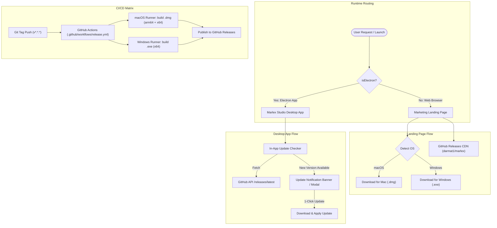

# Design Spec: Marlex Landing Page, Multi-Platform Releases & In-App Auto-Updater

**Date:** 2026-08-22  
**Target Repository:** `darmat1/marlex`  
**Status:** Approved by User  

---

## 1. Overview & Goals

1. **Split Web & Desktop Responsibilities:**
   - **Web (Browser / Vercel):** High-converting marketing landing page for Marlex Content Engine. Highlights AI carousel generation, multi-channel distribution (Telegram, LinkedIn, Threads), Canva-like studio features, and provides direct multi-platform download links (macOS Apple Silicon/Intel, Windows).
   - **Desktop (Electron App):** Full-featured content factory & studio workstation with local AI CLI bridging, offline mode, and in-app update checks.

2. **Multi-Platform Automated Releases via GitHub Actions:**
   - Automated CI/CD matrix build for:
     - macOS `arm64` (Apple Silicon `.dmg` / `.zip`)
     - macOS `x64` (Intel `.dmg` / `.zip`)
     - Windows `x64` (NSIS `.exe` / `.zip`)
   - Assets automatically attached to GitHub Releases on tag push (e.g. `v0.1.1`).

3. **In-App Auto-Updater & Version Checker:**
   - Desktop app reads its current version from `package.json` / Electron runtime.
   - Periodically and on app launch checks `https://api.github.com/repos/darmat1/marlex/releases/latest`.
   - If a new version exists, displays an elegant update notification banner + modal with release notes.
   - Supports 1-click download and fast update.
   - Manual "Check for Updates" button in Settings modal.

---

## 2. Architecture & Components

---

## 3. Detailed Component Specifications

### 3.1 Marketing Landing Page (`src/components/landing/LandingPage.tsx`)
- **Hero Section:**
  - Catchy value proposition: *"Автономный контент-завод и студия каруселей для экспертов и фаундеров"*.
  - Smart Download CTA: detects macOS vs Windows automatically and serves the primary `.dmg` or `.exe` installer link, with a dropdown selector for all platforms.
  - Interactive live preview/mockup of the Marlex Studio canvas.
- **Key Features Grid:**
  - ⚡ *AI генерация каруселей за 3 секунды* (Claude, ChatGPT, Gemini, Ollama).
  - 🎨 *Figma/Canva инспектор* (шрифты Google Fonts & системы, золотые акценты, слои).
  - 📢 *Мульти-постинг* (Telegram, LinkedIn, Threads, Instagram).
  - 🔒 *Локальная безопасность* (работа через локальные CLI без передачи API ключей).
- **Social Proof & Metrics:**
  - Comparison table: Ручное создание каруселей (3-4 часа) vs Marlex AI (2 минуты).
- **FAQ & Footer:**
  - Common questions about AI models, local CLI usage, data privacy, and updates.

### 3.2 Dynamic Download Links & CDN Routing
- GitHub Release download URLs follow standard pattern:
  - macOS (Apple Silicon): `https://github.com/darmat1/marlex/releases/latest/download/Marlex-arm64.dmg`
  - macOS (Intel): `https://github.com/darmat1/marlex/releases/latest/download/Marlex.dmg`
  - Windows: `https://github.com/darmat1/marlex/releases/latest/download/Marlex-Setup.exe`
- Fallback/redirect endpoint `/api/download?platform=mac|win|mac-arm64` can be provided in `api/index.ts`.

### 3.3 Electron In-App Auto-Updater
- **IPC Handlers (`electron/main.ts`):**
  - `updater:check`: Queries GitHub API `https://api.github.com/repos/darmat1/marlex/releases/latest` and compares semantic versions (`semver` comparison).
  - `updater:openDownload`: Opens the release download URL in external browser / shell.
  - `updater:getVersion`: Returns current app version from `app.getVersion()`.
- **Preload API (`electron/preload.ts`):**
  - Exposes `checkUpdate()`, `getAppVersion()`, `openReleaseUrl()`.
- **React Update Banner & Modal:**
  - Shows notification banner when a newer version is detected: *"Доступна новая версия Marlex v{version}"*.
  - "Что нового" changelog preview with 1-click update button.
  - Settings modal has a manual "Проверить обновления" button.

### 3.4 GitHub Actions Multi-Platform Release Workflow
- File: `.github/workflows/release.yml`
- Triggers on tag creation matching `v*` (e.g. `v0.1.1`).
- Matrix strategy:
  - `macos-latest`: compiles `arm64` and `x64` macOS targets (`.dmg`, `.zip`).
  - `windows-latest`: compiles `x64` Windows target (`.exe`).
- Uploads all artifacts to the GitHub Release.

---

## 4. Verification & Testing Plan
1. **Landing Page Testing:**
   - In browser environment (`!isElectron`), verify Landing Page renders with all sections, animations, and responsive layout.
   - Verify OS detection picks correct default download button (macOS on Mac, Windows on PC).
2. **Desktop App Isolation:**
   - Inside Electron (`isElectron === true`), verify the desktop Studio loads directly without showing the landing page.
3. **Update Checker Verification:**
   - Test version comparison logic with mock newer version.
   - Verify update notification banner appears and "Что нового" modal triggers.
   - Verify "Check for Updates" in Settings modal works.
4. **CI/CD Workflow Validation:**
   - Verify `.github/workflows/release.yml` syntax and actions configuration.
